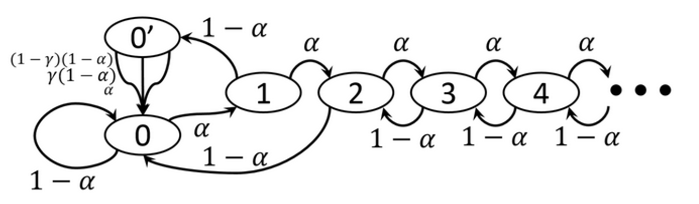
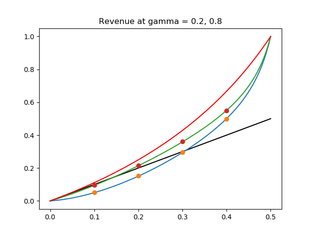

# Selfish-Mining-Simulator

## 1. Important terms in blockchain security

- Incentive compatible: the incentives that motivate the actions of individual participants are consistent with following the rules established by the group. If a blockchain system is incentive compatible, the participants could not make profit by deviating from the protocol.
- Block race: 
- Profit threshold: minimal 𝛼 for which employing dishonest mining strategies becomes profitable.
- Block propagation:
- Block withholding: 

## 2. Markov Chain Model

*Reference: Majority is not Enough* 

In this paper, the authors came up with the "selfish mining" attack, which showed that the bitcoin system is not incentive compatible.

### 2.1 Selfish Mining Model 1

### 2.2 Simulation

Comparing the result of simulation and theoritical result of simulation using 

Simulation Result:

In this figure, the black line is the return if mining honestly, while the red line is an upper bound for selfish mining (see in 3.1). The blue and green line indicates the theoritical revenue of selfish mining model 1, with gamma = 0.2, 0.8. The dots show the simulated average revenue.

## 3. Markov Decision Process Model

*Reference: Optimal Selfish Mining Strategies in Bitcoin* 

### 3.1 A simple Upper Bound for Profit of Selfish Mining 

Consider an extreme case: If every block mined by the selfish miner could override one block of honest miner, the revenue of selfish miner would be: $\frac{\alpha}{1-\alpha}$.
As a result, this is a simple upper bound for profit of selfish mining.

### 3.2 Construct the MDP Model for Selfish Mining

#### Hypotheses of Model:

1. There is only one attacker in the network.
2. Communication of newly generated blocks is much faster than block creation, so no blocks are generated while others are being transmitted.
3. Blocks are created in the network according to a Poisson process. 
4. Mining power of attacker: 𝛼, fraction of the whole network
Block race winning rate: 𝛾

#### Two decisions made by the attacker:
1. Which block to extend at any time t.
2. Which block to release at any time t.

#### 5-tumple of MDP
1. Action space: {Adopt, Override, Match, Wait}
2. State space: {a, h, fork}
a: length of private chain, h: length of public chain
fork: {relevant, irrelevant, active}
State of the form (a, h, relevant) means that the previous state was of the form (a, h − 1, ·); this implies that if a ≥ h, match is feasible.
 Conversely, (a, h, irrelevant) denotes the case where the previous state was (a − 1, h, ·), rendering match now ineffective, as all honest nodes received already the h’th block. 
The third label, active, represents the case where the honest network is already split, due to a previous match action; this information affects the transition to the next state, as described below. We will refer to states as (a, h) or (a, h,·), in contexts where the fork label plays no effective role. 
3. Transtion and reward:

#### Objective function

1. The initial objective function is non-linear because the 
2. We introduce the parameter 

#### Covert to Finite MDP

