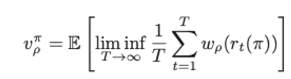

# Selfish-Mining-Simulator

## 1. Important terms in blockchain security

- Incentive compatible: the incentives that motivate the actions of individual participants are consistent with following the rules established by the group. If a blockchain system is incentive compatible, the participants could not make profit by deviating from the protocol.
- Block race: 
- Profit threshold: minimal 𝛼 for which employing dishonest mining strategies becomes profitable.
- Chain quality: High chain quality means malicious miners could not alter the public ledger.
- Block propagation:
- Block withholding: 
- Consensus Block: The last block recognized by all miners.

## 2. Markov Chain Model

*Reference: Majority is not Enough* [link](https://www.cs.cornell.edu/~ie53/publications/btcProcFC.pdf)

In this paper, the authors came up with the "selfish mining" attack, which showed that the bitcoin system is not incentive compatible.

### 2.1 Selfish Mining Model 1

### 2.2 Simulation

Comparing the result of simulation and theoritical result of simulation using 

Simulation Result:

In this figure, the black line is the return if mining honestly, while the red line is an upper bound for selfish mining (see in 3.1). The blue and green line indicates the theoritical revenue of selfish mining model 1, with gamma = 0.2, 0.8. The dots show the simulated average revenue.

## 3. Markov Decision Process Model

*Reference: Optimal Selfish Mining Strategies in Bitcoin* [link](https://arxiv.org/pdf/1507.06183.pdf)

### 3.1 A simple Upper Bound for Profit of Selfish Mining 

Consider an extreme case: If every block mined by the selfish miner could override one block of honest miner, the revenue of selfish miner would be: $\frac{\alpha}{1-\alpha}$.
As a result, this is a simple upper bound for profit of selfish mining.

### 3.2 Construct the MDP Model for Selfish Mining

#### Hypotheses of Model:

1. There is only one attacker in the network.
2. Communication of newly generated blocks is much faster than block creation, so no blocks are generated while others are being transmitted.
3. Blocks are created in the network according to a Poisson process. 
4. Mining power of attacker: 𝛼, fraction of the whole network
Block race winning rate: 𝛾

#### Two decisions made by the attacker:
1. Which block to extend at any time t.
2. Which block to release at any time t.

#### 5-tumple of MDP
1. Action space: {Adopt, Override, Match, Wait}
2. State space: {a, h, fork}
  - a: length of private chain
  - h: length of public chain
  - fork: {relevant, irrelevant, active}
    - State of the form (a, h, relevant) means that the previous state was of the form (a, h − 1, ·); this implies that if a ≥ h, match is feasible.
    - Conversely, (a, h, irrelevant) denotes the case where the previous state was (a − 1, h, ·), rendering match now ineffective, as all honest nodes received already the h’th block. 
    - The third label, active, represents the case where the honest network is already split, due to a previous match action; this information affects the transition to the next state, as described below. We will refer to states as (a, h) or (a, h,·), in contexts where the fork label plays no effective role. 

3. Transtion and reward:

#### Objective function

1. Maximize relative revenue: 𝑘(𝑥, 𝑦)=𝑥/(𝑥+𝑦)=1/(1+𝑦/𝑥).
Note that the objective function is non-linear. 
2. To construct a linear function, we use the following function:
𝜔_𝜌 (𝑥, 𝑦)=(1−𝜌)∙𝑥− 𝜌∙𝑦    
The objective function is constructed as: 

#### Covert to Finite MDP

## 4. Evaluating the Proof of Work Consensus Protocol's Security

*Reference: Lay Down the Common Metrics: Evaluating Proof-of-Work Consensus Protocols’ Security* [link](https://www.esat.kuleuven.be/cosic/publications/article-3005.pdf)

### 4.1 Whether a Secure PoW protocol is possible?
Bitcoin's Nakamoto Consensus (NC) Protocol fails to achieve perfect chain quality.    
Ethereum, Bitcoin-NG, DECOR+, Byzcoin and Publish or Perish, aim to solve the problem by raising the chain quality. (Better-chain-quality protocol)   
Other designs, represented by Fruitchains, DECOR+ and Subchains, claim to successfully defend against the attacks in the absence of perfect chain quality. (Attack-resistant protocol) 

However, the effectiveness of these design remained self-claimed. So, it is necessary to introduce a **multi-metric quantitative evaluation framework** to evaluate the security of them.

### 4.2 Multi-metric Quantitative Evaluation Framework
|Metic|Explanation|
|----|----|
|Chain Quality| This metric measures the difficulty to substitute the honest main chain blocks. |
|Incentive compatibility | This metric measures a protocol’s selfish mining resistance.|
|Subversion gain | This metric measures the profitability of double-spending attacks|
|Censorship susceptibility | Maximum fraction of income loss the attacker incur on compliant miners in a censorship retaliation attack.|

### 4.3 Better-chain-quality Protocols

| Tie-breaking Methods | Modeling|
| ---- | ---- |
|Uniform Tie-Breaking|MDP, split the hash value space into a small number of regions to reduce number of states|
|Smallest Hash Tie-breaking|MDP |
|Unpredictable Derministic Tie-breaking||
|Publish or Perish||

We attribute NC’s poor chain quality to the protocol’s in- capability in distinguishing the honest chain from the attacker chain, due to information asymmetry. Unfortunately, we believe it is difficult to solve this infor- mation asymmetry within PoW protocols’ security assump- tions.

### Typical Attack-resistance Protocol
|Protocol|Subversion Gain Analysis|Censorship Susceptibility Analysis|
|----|----|----|
Fruitchains|||
Reward-Splitting Protocol|||
Subchains|||

### SECURITY TRADE-OFFS IN ATTACK RESISTANCE
- Security vs. Performance
- “Rewarding the Bad” vs. “Punishing the Good”: 
  - Reward-all protocols improve censorship resistance by increasing the difficulty to invalidate other miners’ rewards, at the price of removing the risk to fork the blockchain, thus encouraging double-spending attacks. 
  - Punishment protocols improve selfish mining and double-spending resistance by discouraging malicious behaviors, at the price of lowering the attacker’s diffi- culty to damage the compliant miners’ income, thus facilitating censorship.
  - Reward-lucky protocols, contrary to their design- ers’ intention, allow the attacker to invalidate the compliant miners’ “lucky” blocks with the attacker’s “unlucky” units in a risk-free manner, leaving them more vulnerable to all three attacks.
  - We conclude that none of the three approaches can improve the security of PoW against three major attacks; they only offer different trade-offs in resistance. 

